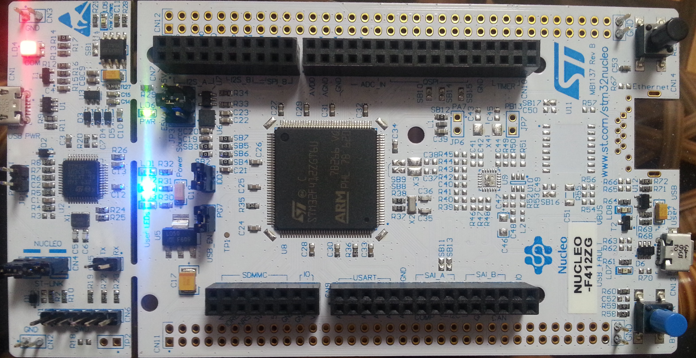

# NUCLEO-F412ZG 开发板 BSP 说明

## 简介

本文档为 RT-Thread 开发团队为 NUCLEO-F412ZG 开发板提供的 BSP (板级支持包) 说明。

主要内容如下：

- 开发板资源介绍
- BSP 快速上手
- 进阶使用方法

通过阅读快速上手章节开发者可以快速地上手该 BSP，将 RT-Thread 运行在开发板上。在进阶使用指南章节，将会介绍更多高级功能，帮助开发者利用 RT-Thread 驱动更多板载资源。

## 开发板介绍

探索者 NUCLEO-F412ZG 是意法半导体推出的一款基于 ARM Cortex-M4 内核的开发板，最高主频为 100Mhz，该开发板具有丰富的板载资源，可以充分发挥 STM32F411ZG 的芯片性能。

开发板外观如下图所示：



该开发板常用 ** 板载资源 ** 如下：

- MCU：STM32F411ZG，主频 100MHz，1024KB FLASH ，256KB RAM。
- 常用外设
  - LED：3 个，USB communication (LD1), user LED (LD2), power LED (LD3) 。
  - 按键，2 个，USER and RESET 。
- 常用接口：USB 支持 3 种不同接口：虚拟 COM 端口、大容量存储和调试端口。
- 调试接口，板载 ST-LINK/V2-1 调试器。

开发板更多详细信息请参考意法半导体 [NUCLEO-F412ZG 开发板介绍](https://www.st.com/en/evaluation-tools/nucleo-f412zg.html)。

## 外设支持

本 BSP 目前对外设的支持情况如下：

| **片上外设** | **支持情况** |               **备注**                |
| :------------ | :----------: | :-----------------------------------: |
| GPIO         |     支持     | PA0, PA1... PH1 ---> PIN: 0, 1...63 |
| UART         |     支持     |              UART2,UART3            |
| onchip_flash |     支持     |                                     |

## 使用说明

使用说明分为如下两个章节：

- 快速上手

    本章节是为刚接触 RT-Thread 的新手准备的使用说明，遵循简单的步骤即可将 RT-Thread 操作系统运行在该开发板上，看到实验效果 。

- 进阶使用

    本章节是为需要在 RT-Thread 操作系统上使用更多开发板资源的开发者准备的。通过使用 ENV 工具对 BSP 进行配置，可以开启更多板载资源，实现更多高级功能。


### 快速上手

本 BSP 为开发者提供 MDK5 和 IAR 工程，并且支持 GCC 开发环境。下面以 MDK5 开发环境为例，介绍如何将系统运行起来。

#### 硬件连接

使用 Type-A to Micro-B 线连接开发板和 PC 供电，红色 LED LD3 (PWR) 和 LD1 (COM) 会点亮。

#### 编译下载

双击 project.uvprojx 文件，打开 MDK5 工程，编译并下载程序到开发板。

> 工程默认配置使用 ST-LINK 下载程序，点击下载按钮即可下载程序到开发板。

#### 运行结果

下载程序成功之后，系统会自动运行，观察开发板上 LED 的运行效果，红色 LD3 和 LD1 常亮、绿色 LD2 会周期性闪烁。

USB 虚拟 COM 端口默认连接串口 3，在终端工具里打开相应的串口（115200-8-1-N），复位设备后，可以看到 RT-Thread 的输出信息:

```bash
 \ | /
- RT -     Thread Operating System
 / | \     4.0.2 build Oct 20 2019
 2006 - 2019 Copyright by rt-thread team
msh >
```
### 进阶使用

此 BSP 默认只开启了 GPIO 和 串口 3 的功能，更多高级功能需要利用 ENV 工具对 BSP 进行配置，步骤如下：

1. 在 BSP 下打开 env 工具。

2. 输入 `menuconfig` 命令配置工程，配置好之后保存退出。

3. 输入 `pkgs --update` 命令更新软件包。

4. 输入 `scons --target=mdk5/iar` 命令重新生成工程。

本章节更多详细的介绍请参考 [STM32 系列 BSP 外设驱动使用教程](../docs/STM32 系列 BSP 外设驱动使用教程. md)。

## 注意事项

暂无

## 联系人信息

维护人:

- [flybreak](https://github.com/guozhanxin) ，邮箱：<g1171407708@163.com>